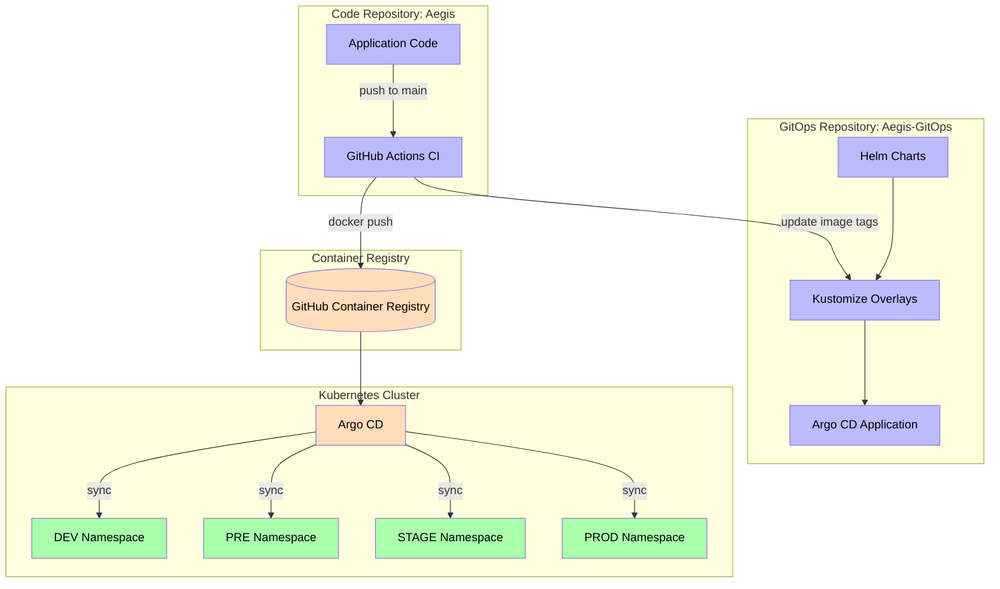
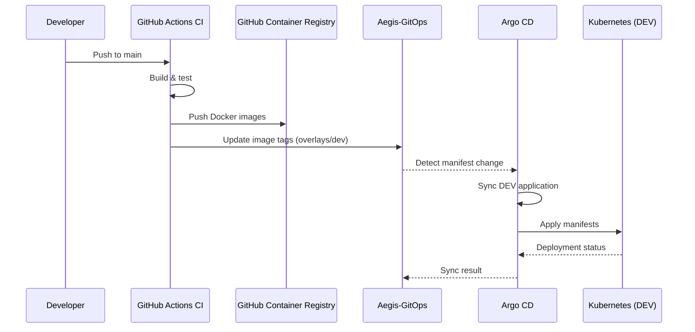
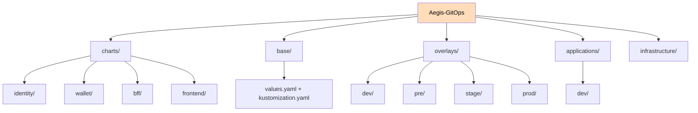
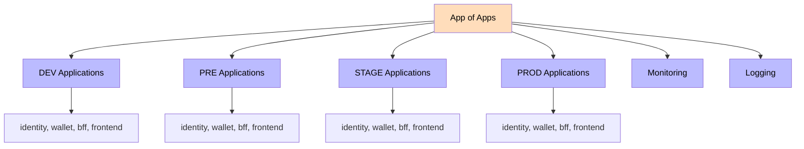
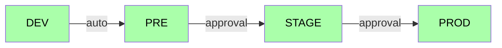

# Aegis-GitOps

Declarative, Git-driven deployment configuration for the Aegis platform. This repository is part of the Aegis platform and follows the same documentation and architecture standards as every Aegis repository.

## Architecture



## Deployment Flow



## Repository structure



## Helm charts

Each service has a standalone Helm chart under `charts/<service>/` with the following templates:

- `deployment.yaml` - replicas, image, probes, resources, affinity, tolerations
- `service.yaml` - ClusterIP service on the service port
- `configmap.yaml` - environment variables from `.Values.config`
- `ingress.yaml` - optional ingress (enabled via `.Values.ingress.enabled`)
- `hpa.yaml` - optional HorizontalPodAutoscaler (`.Values.autoscaling.enabled`)
- `pdb.yaml` - optional PodDisruptionBudget (`.Values.podDisruptionBudget.enabled`)

## Overlay strategy

Environment-specific configuration is provided via Helm value files in each overlay. Argo CD applications point a chart at `overlays/<env>/<service>-values.yaml`.

| Parameter | DEV | PRE | STAGE | PROD |
|-----------|-----|-----|-------|------|
| Replicas | 1 | 2 | 2 | 3 (HPA 3-10) |
| CPU request | 100m | 250m | 250m | 500m |
| Memory request | 128Mi | 256Mi | 256Mi | 512Mi |
| HPA | No | No | No | Yes |
| PDB | No | No | Yes (1) | Yes (2) |
| Affinity | No | No | No | Yes (anti-affinity) |

## Environments

| Environment | Overlay | Namespace | Status |
|-------------|---------|-----------|--------|
| DEV         | `overlays/dev/`   | `aegis-dev`   | Active |
| PRE         | `overlays/pre/`   | `aegis-pre`   | Stub   |
| STAGE       | `overlays/stage/` | `aegis-stage` | Stub   |
| PROD        | `overlays/prod/`  | `aegis-prod`  | Stub   |

## Argo CD and Environment Promotion

Argo CD is bootstrapped via GitOps and manages every application through an **App of Apps** pattern.



### Sync policies

| Environment | Sync | Prune | Self-Heal |
|-------------|------|-------|-----------|
| DEV   | Auto  | Yes | Yes |
| PRE   | Auto  | Yes | Yes |
| STAGE | Manual/Approval | Yes | Yes |
| PROD  | Manual/Approval | No  | Yes |

### Promotion flow



Promotion is declarative: updating the image tag in `overlays/<env>/*-values.yaml` in Git is the promotion. Argo CD syncs DEV and PRE automatically; STAGE and PROD require a manual sync (approval gate).

### Bootstrap

Apply the bootstrap application once, then Argo CD self-manages everything:

```
kubectl apply -k infrastructure/argocd/install
kubectl -n argocd apply -f applications/aegis-app-of-apps.yaml
```

## Local Development (minikube)

### Prerequisites

- Docker, Minikube, kubectl, Helm, JDK 21
- A GitHub PAT with `read:packages` scope to pull private GHCR images

### 1. Create the cluster

```bash
minikube start --cpus 4 --memory 8192
```

### 2. Create the GHCR pull secret in every environment namespace

```bash
kubectl create namespace aegis-dev aegis-pre aegis-stage aegis-prod argocd
for ns in aegis-dev aegis-pre aegis-stage aegis-prod; do
  kubectl create secret docker-registry ghcr-pull -n $ns \
    --docker-server=ghcr.io \
    --docker-username=<your-user> \
    --docker-password=<PAT>
done
```

The charts reference this secret via `imagePullSecrets[].name = ghcr-pull` in the environment overlays.

### 3. Install Argo CD

```bash
kubectl apply -k infrastructure/argocd/install
# wait for pods
kubectl wait -n argocd --for=condition=Ready pod -l app.kubernetes.io/name=argocd-server --timeout=300s
```

### 4. Bootstrap the App of Apps

```bash
kubectl -n argocd apply -f applications/aegis-app-of-apps.yaml
```

### 5. Access the dashboard

```bash
kubectl -n argocd get secret argocd-initial-admin-secret -o jsonpath='{.data.password}' | base64 -d
kubectl port-forward svc/argocd-server -n argocd 8080:443
# https://localhost:8080  (user: admin)
```

### 6. Promote between environments

Update the image `tag` in `overlays/<env>/*-values.yaml`. DEV and PRE auto-sync; STAGE and PROD require a manual sync (approval gate).

## Image tag updates