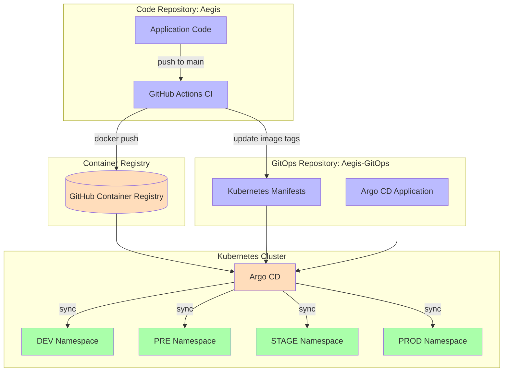
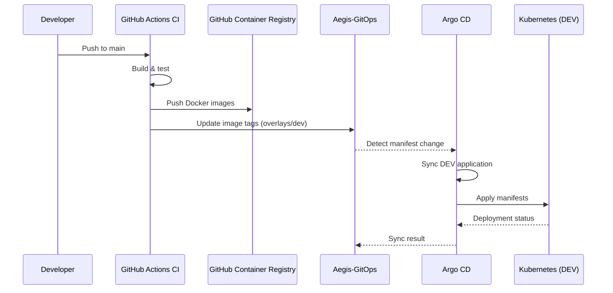
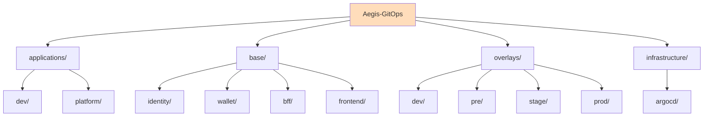

# Aegis-GitOps

Declarative, Git-driven deployment configuration for the Aegis platform. This repository is part of the Aegis platform and follows the same documentation and architecture standards as every Aegis repository.

## Architecture

## Deployment Flow

## Repository structure

## Environments

| Environment | Overlay | Status |
|-------------|---------|--------|
| DEV         | `overlays/dev/`   | Active |
| PRE         | `overlays/pre/`   | Stub   |
| STAGE       | `overlays/stage/` | Stub   |
| PROD        | `overlays/prod/`  | Stub   |

## Image tag updates

The CI pipeline in `Aegis` updates `overlays/dev/kustomization.yaml` with the latest image tag after every merge to `main`.

Images are hosted at `ghcr.io/AlexAlvarezGallardo-GitHub/`.