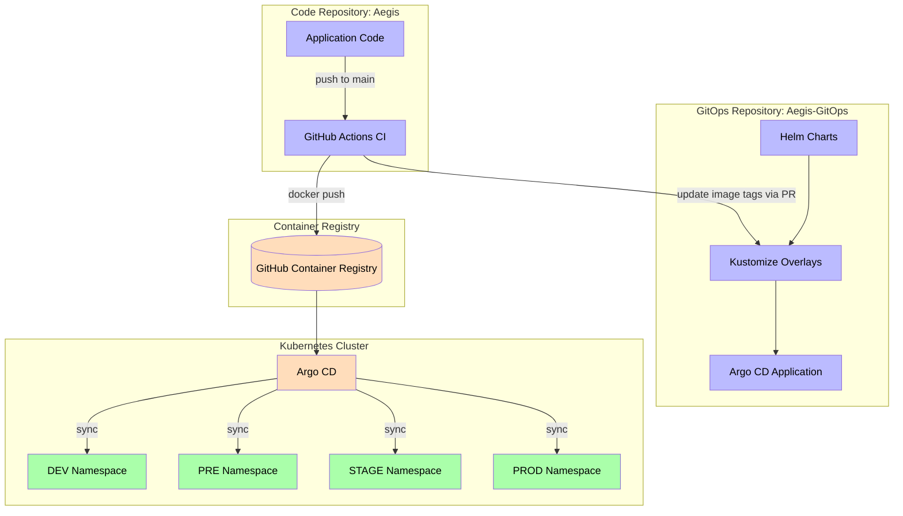
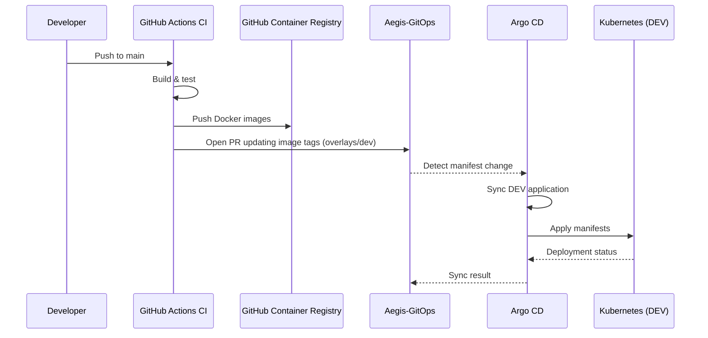
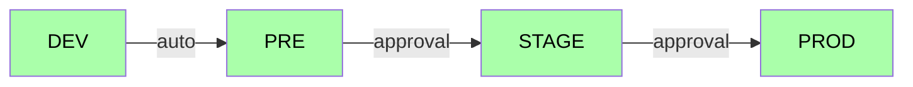
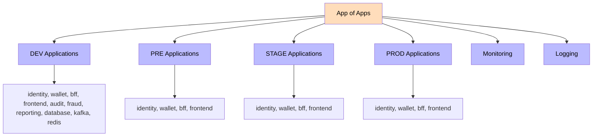

<picture>
  <source media="(prefers-color-scheme: dark)" srcset="https://img.shields.io/badge/GitOps-326CE5?style=for-the-badge&labelColor=1a1a2e&logo=argocd&logoColor=white">
  
</picture>
<picture>
  <source media="(prefers-color-scheme: dark)" srcset="https://img.shields.io/badge/Kubernetes-326CE5?style=for-the-badge&logo=kubernetes&logoColor=white&labelColor=1a1a2e">
  
</picture>
<picture>
  <source media="(prefers-color-scheme: dark)" srcset="https://img.shields.io/badge/Helm-0F1689?style=for-the-badge&logo=helm&logoColor=white&labelColor=1a1a2e">
  
</picture>
<picture>
  <source media="(prefers-color-scheme: dark)" srcset="https://img.shields.io/badge/Argo%20CD-EF7B4D?style=for-the-badge&logo=argocd&logoColor=white&labelColor=1a1a2e">
  
</picture>
<picture>
  <source media="(prefers-color-scheme: dark)" srcset="https://img.shields.io/badge/Infrastructure%20as%20Code-526EFF?style=for-the-badge&labelColor=1a1a2e">
  
</picture>

---

# **Aegis-GitOps** — Declarative Deployment

> **The single source of truth for everything that runs in the Aegis Kubernetes cluster. Every deployment starts as a pull request; Argo CD converges the cluster to the declared state.**

Aegis-GitOps is the [GitOps](https://opengitops.dev/) repository of the [Aegis platform](https://github.com/AlexAlvarezGallardo-GitHub/Aegis). It holds the Helm charts, Kustomize overlays, Argo CD applications, and the platform infrastructure (databases, Kafka, Redis, observability) — everything needed to reproduce the running platform from Git alone.

The design goal is simple and strict: **no one deploys to the cluster directly.** Application code is pushed to the Aegis repository, built in GitHub Actions, published to GHCR, and promoted here as image tags. Argo CD owns delivery — a cluster change that is not committed to this repository does not happen.

---

## Table of Contents

- [How it fits together](#how-it-fits-together)
- [Features](#features)
- [Repository structure](#repository-structure)
- [Helm charts](#helm-charts)
- [Environments & promotion](#environments--promotion)
- [Platform infrastructure](#platform-infrastructure)
- [Observability](#observability)
- [Local development (minikube)](#local-development-minikube)
- [Image tag updates](#image-tag-updates)
- [Contributing](#contributing)

---

## How it fits together





---

## Features

- **Pure GitOps delivery** — deployments are pull requests; no manual `kubectl apply` in normal operation.
- **App of Apps** — Argo CD is bootstrapped once and then self-manages every environment and platform component.
- **Helm packaging** — reusable per-service charts with opt-in HPA, PodDisruptionBudget, ingress and affinity.
- **Kustomize overlays** — one thin overlay per environment (`dev`, `pre`, `stage`, `prod`) over a shared base.
- **Progressive promotion** — auto-sync for lower environments, approval-gated sync for `stage` and `prod`.
- **Immutable image tags** — deployments reference exact image SHAs, never `latest`.
- **Managed platform infrastructure** — PostgreSQL, Kafka, Redis and the full observability stack are defined here.
- **Reproducible locally** — `scripts/setup-minikube.ps1` stands up a full single-node cluster.

---

## Repository structure

```
Aegis-GitOps
├── applications/            # Argo CD Application manifests (App of Apps)
│   ├── app-of-apps-dev.yaml # Bootstraps the DEV applications (incl. monitoring + logging)
│   └── dev|pre|stage|prod/  # Per-service Applications for each environment
├── base/                    # Shared Kustomize base consumed by all overlays
│   ├── kustomization.yaml   # configMapGenerator -> aegis-base-values
│   └── values.yaml          # Shared reference values
├── charts/                  # Reusable Helm charts, one per service
│   ├── identity/  wallet/  bff/  frontend/  audit/  fraud/  reporting/
├── overlays/                # Environment overlays (Helm values + namespace)
│   ├── dev/  pre/  stage/  prod/
├── infrastructure/          # Platform components managed via GitOps
│   ├── argocd/              # Argo CD install, config and RBAC
│   ├── database/            # PostgreSQL (identity, wallet, audit, fraud, reporting) — base + overlays
│   ├── kafka/               # Kafka + ZooKeeper — base + overlays
│   ├── redis/               # Redis session store — base + overlays
│   ├── logging/             # Loki + Promtail
│   └── monitoring/          # Prometheus, Grafana, Tempo, Alertmanager, node exporters
└── scripts/
    └── setup-minikube.ps1   # One-command local cluster bootstrap
```

---

## Helm charts

Each service ships a standalone chart under `charts/<service>/` exposing consistent, production-oriented templates:

| Template | Purpose |
|----------|---------|
| `deployment.yaml` | replicas, image, probes, resources, affinity, tolerations |
| `service.yaml` | ClusterIP service on the service port |
| `configmap.yaml` | environment variables from `.Values.config` |
| `ingress.yaml` | optional ingress (`ingress.enabled`) |
| `hpa.yaml` | optional HorizontalPodAutoscaler (`autoscaling.enabled`) |
| `pdb.yaml` | optional PodDisruptionBudget (`podDisruptionBudget.enabled`) |
| `serviceaccount.yaml` | dedicated service account per chart |

Charts are linted and rendered for every environment before a promotion PR is merged, so invalid templates never reach the cluster.

---

## Environments & promotion

Environment-specific configuration lives in Helm value files under `overlays/<env>/`. Argo CD applications point a chart at `overlays/<env>/<service>-values.yaml`.

### Environment matrix

| Parameter | DEV | PRE | STAGE | PROD |
|-----------|-----|-----|-------|------|
| Replicas | 1 | 2 | 2 | 3 |
| HPA | No | No | No | Yes (3–10 @ 80%) |
| PDB | No | No | Yes (min 1) | Yes (min 2) |
| Affinity | No | No | No | Yes (pod anti-affinity) |
| CPU request | 250m | 250m | 250m | 500m |
| Memory request | 384Mi | 256Mi | 256Mi | 512Mi |
| Sync policy | Auto | Auto | Manual/approval | Manual/approval |

> Values shown follow the `bff` chart; the other services follow the same progressive pattern.

### Sync policies

| Environment | Overlay | Namespace | Sync | Prune | Self-Heal |
|-------------|---------|-----------|------|-------|-----------|
| DEV | `overlays/dev/` | `aegis-dev` | Auto | Yes | Yes |
| PRE | `overlays/pre/` | `aegis-pre` | Auto | Yes | Yes |
| STAGE | `overlays/stage/` | `aegis-stage` | Manual/approval | Yes | Yes |
| PROD | `overlays/prod/` | `aegis-prod` | Manual/approval | No | Yes |



Promotion is declarative: updating an image tag in `overlays/<env>/*-values.yaml` **is** the promotion. Argo CD syncs DEV and PRE automatically; STAGE and PROD are gated behind a manual sync (approval gate).

### App of Apps



### Bootstrap

Apply the bootstrap once, then Argo CD self-manages everything:

```bash
kubectl apply -k infrastructure/argocd/install
kubectl -n argocd apply -f applications/app-of-apps-dev.yaml
```

---

## Platform infrastructure

Beyond application manifests, this repository defines the platform components the services depend on:

| Component | Location | Notes |
|-----------|----------|-------|
| **Argo CD** | `infrastructure/argocd/` | install, app config, RBAC |
| **PostgreSQL** | `infrastructure/database/` | one instance per bounded context (identity, wallet, audit, fraud, reporting) |
| **Kafka + ZooKeeper** | `infrastructure/kafka/` | event backbone |
| **Redis** | `infrastructure/redis/` | BFF session store |
| **Prometheus + Grafana + Alertmanager** | `infrastructure/monitoring/` | metrics and alerting |
| **Tempo** | `infrastructure/monitoring/tempo/` | distributed tracing |
| **Loki + Promtail** | `infrastructure/logging/` | centralized, structured logs |

Each component uses the same base/overlay pattern, so environment-specific configuration stays explicit and reviewable.

---

## Observability

Services export OpenTelemetry telemetry to the managed stack:

- **Traces** → OTLP → **Tempo** (`http://tempo.monitoring.svc:4318/v1/traces`)
- **Metrics** → **Prometheus** (via `/actuator/prometheus` and node/kube exporters)
- **Logs** → **Promtail** → **Loki**
- **Dashboards & alerts** → **Grafana** + **Alertmanager**

The Grafana dashboards shipped in this repository cover system overview, JVM, HTTP requests and Kafka consumers.

---

## Local development (minikube)

A full single-node reproduction of the platform can be stood up locally. The provided script automates the whole flow:

```powershell
# One command: installs/updates minikube, starts the cluster,
# creates the GHCR pull secret and bootstraps Argo CD
./scripts/setup-minikube.ps1
```

### Manual steps

Prerequisites: Docker, Minikube, kubectl, Helm, and a GitHub PAT with `read:packages` scope.

```bash
# 1. Create the cluster
minikube start --cpus 4 --memory 8192

# 2. Create namespaces and the GHCR pull secret (charts reference imagePullSecrets[].name = ghcr-pull)
kubectl create namespace aegis-dev aegis-pre aegis-stage aegis-prod argocd
for ns in aegis-dev aegis-pre aegis-stage aegis-prod; do
  kubectl create secret docker-registry ghcr-pull -n $ns \
    --docker-server=ghcr.io \
    --docker-username=<your-user> \
    --docker-password=<PAT>
done

# 3. Install Argo CD
kubectl apply -k infrastructure/argocd/install
kubectl wait -n argocd --for=condition=Ready pod -l app.kubernetes.io/name=argocd-server --timeout=300s

# 4. Bootstrap the App of Apps
kubectl -n argocd apply -f applications/app-of-apps-dev.yaml

# 5. Access the Argo CD dashboard
kubectl -n argocd get secret argocd-initial-admin-secret -o jsonpath='{.data.password}' | base64 -d
kubectl port-forward svc/argocd-server -n argocd 8080:443
# https://localhost:8080  (user: admin)
```

---

## Image tag updates

Application images are published by the Aegis repository CI. The `gitops-update` job in that pipeline opens a pull request against this repository updating the affected image tags in the environment overlays, then squash-merges it after validation.

To promote a build manually, update the `image.tag` in `overlays/<env>/<service>-values.yaml`:

```yaml
image:
  repository: ghcr.io/alexalvarezgallardo-github/bff-service
  tag: <immutable-image-sha>
```

DEV and PRE auto-sync after the merge; STAGE and PROD require a manual sync in Argo CD.

---

## Contributing

This repository follows the same engineering standards as the rest of the Aegis platform.

- **Contributing guide** → [`CONTRIBUTING.md`](CONTRIBUTING.md)
- **Changelog** → [`CHANGELOG.md`](CHANGELOG.md)
- **Security policy** → [`SECURITY.md`](SECURITY.md)
- **License** → [`LICENSE.md`](LICENSE.md)

### Related repositories

| Repository | Purpose |
|------------|---------|
| [Aegis](https://github.com/AlexAlvarezGallardo-GitHub/Aegis) | Application code: microservices, frontend, CI/CD, specs |
| [Aegis-Portfolio](https://github.com/AlexAlvarezGallardo-GitHub/Aegis-Portfolio) | Engineering portfolio website |
