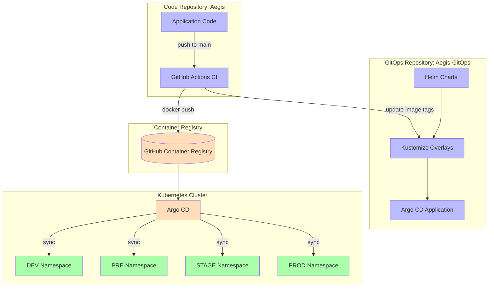
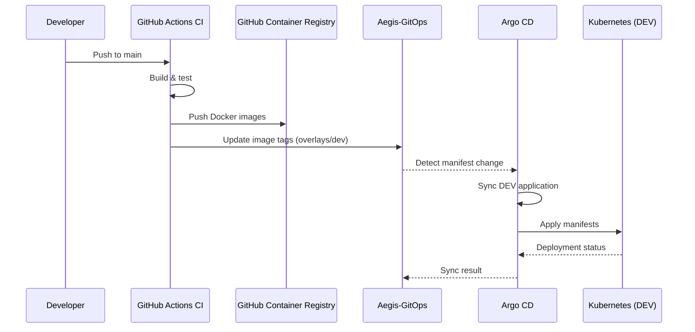

# Aegis-GitOps

Declarative, Git-driven deployment configuration for the Aegis platform. This repository is part of the Aegis platform and follows the same documentation and architecture standards as every Aegis repository.

## Architecture

## Deployment Flow

## Repository structure

## Helm charts

Each service has a standalone Helm chart under `charts/<service>/` with the following templates:

- `deployment.yaml` - replicas, image, probes, resources, affinity, tolerations
- `service.yaml` - ClusterIP service on the service port
- `configmap.yaml` - environment variables from `.Values.config`
- `ingress.yaml` - optional ingress (enabled via `.Values.ingress.enabled`)
- `hpa.yaml` - optional HorizontalPodAutoscaler (`.Values.autoscaling.enabled`)
- `pdb.yaml` - optional PodDisruptionBudget (`.Values.podDisruptionBudget.enabled`)

## Overlay strategy

Environment-specific configuration is provided via Helm value files in each overlay. Argo CD applications point a chart at `overlays/<env>/<service>-values.yaml`.

| Parameter | DEV | PRE | STAGE | PROD |
|-----------|-----|-----|-------|------|
| Replicas | 1 | 2 | 2 | 3 (HPA 3-10) |
| CPU request | 100m | 250m | 250m | 500m |
| Memory request | 128Mi | 256Mi | 256Mi | 512Mi |
| HPA | No | No | No | Yes |
| PDB | No | No | Yes (1) | Yes (2) |
| Affinity | No | No | No | Yes (anti-affinity) |

## Environments

| Environment | Overlay | Namespace | Status |
|-------------|---------|-----------|--------|
| DEV         | `overlays/dev/`   | `aegis-dev`   | Active |
| PRE         | `overlays/pre/`   | `aegis-pre`   | Stub   |
| STAGE       | `overlays/stage/` | `aegis-stage` | Stub   |
| PROD        | `overlays/prod/`  | `aegis-prod`  | Stub   |

## Image tag updates

The CI pipeline in `Aegis` updates the image `tag` in `overlays/dev/*-values.yaml` with the latest image tag after every merge to `main`.

Images are hosted at `ghcr.io/AlexAlvarezGallardo-GitHub/`.